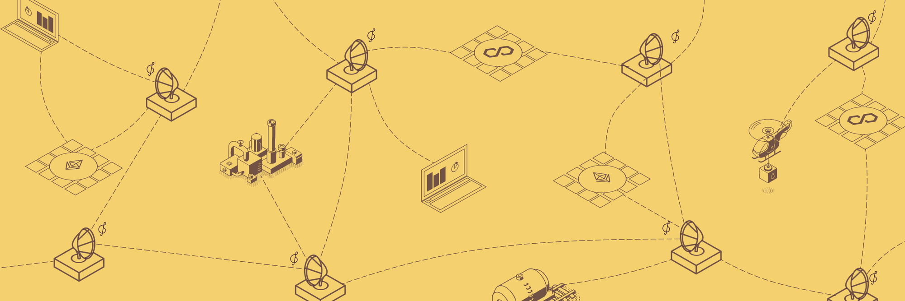

<div align="center">
   <a href="https://logstore.usher.so?ref=github">Website</a>
   <span> | </span>
   <a href="https://docs.logstore.usher.so?ref=github">Documentation</a>
   <span> | </span>
   <a href="https://go.usher.so/discord">Discord</a>
   <span> | </span>
   <a href="https://go.usher.so/twitter">Twitter</a>
</div>
<div align="center">
	<div>
		<span>
			<a href="#"></a>
		</span>
		<span>
			<a href="https://www.gnu.org/licenses/agpl-3.0"></a>
		</span>
	</div>
</div>

<h4>Powered by</h4>
<div>
<a href="https://docs.streamr.network/?ref=logstore" target="_blank" rel="noopener">
    
</a>
<a href="https://www.kyve.network/?ref=logstore" target="_blank" rel="noopener">
    
</a>
<a href="https://www.arweave.org/?ref=logstore" target="_blank" rel="noopener">
    
</a>
<br clear="left" />
</div>

# **Log Store: Decentralized Custom Data Management**

Welcome to Log Store, your gateway to secure, efficient, trustless, decentralized custom data management. Log Store is a cutting-edge network that provides robust and permanent storage for time-series event data from an array of devices. With the ability to query data using timestamps, and the assurance that all data is verified through the network's consensus, Log Store is a powerful tool in the modern data-driven landscape. This initiative is spearheaded by [Usher Labs](https://www.usher.so/), committed to revolutionizing data-driven digital asset management by converting digital interactions into secure on-chain outcomes.

This monorepo is the home of the key components that maintain the Log Store Network operational.

## Table of Contents

1. **[Key Features](#-key-features-security-efficiency-and-empowerment-in-data-management)**
2. **[Architecture and Components](#-architecture-and-components)**
3. **[AlphaNet: The Foundation](#-alphanet-the-foundation)**
4. **[Getting Started](#-getting-started)**
5. **[Interfaces and Tools](#-interfaces-and-tools)**
6. **[Packages Overview](#-packages-overview)**
7. **[What Can You Build?](#-what-can-you-build)**
8. **[Community and Support](#-community-and-support)**
9. **[License](#-license)**

## ⭐ Key Features: Security, Efficiency, and Empowerment in Data Management

Traditional data management systems are often centralized, creating a host of challenges, including security vulnerabilities, data silos, dependence on third parties, and high maintenance costs. Log Store transforms data management through decentralization by addressing these issues head-on:

- **Security & Integrity**: By leveraging cryptographic security and decentralized architecture, Log Store ensures that data is tamper-proof and immutable. The integrity of data is guaranteed through consensus algorithms that verify the information across the network.
- **Efficiency**: High throughput and low latency are crucial in data transactions. Log Store is designed to provide an efficient environment for storing and querying data. Its dynamic pricing model ensures cost optimization, as the users fairly compensate network operators based on the services they utilize.
- **Interoperability & Composability**: Time-series data composability in Log Store facilitates trustless decentralized ETL (Extract, Transform, Load) processes, enabling seamless data management across platforms.
- **User Empowerment**: Log Store empowers users by granting them full control over their data. This autonomy eliminates the need for third-party services, enabling users to manage and query data according to their specific needs.
- **Trustlessness & Permissionlessness**: Data transmitted over streams/topics to be stored by the Log Store Network do not require anything more than token management and wallet authentication. Access management is cryptographically determined, and all data stored yields a time-series append-only event log.
-
## **🔧 Architecture and Components**

Log Store employs a multi-layered architecture to achieve decentralized, secure, and efficient custom-data management:

- **Broker Network**: The Broker Network is the first layer, comprising Streamr Broker Nodes integrated with the Log Store Plugin. This layer stores real-time events and facilitates query connections through HTTP. The Broker Network is essential for providing high throughput and low latency, ensuring data is efficiently processed and readily available.
- **Validator Network**: Operating as the second layer, the Validator Network is built on the KYVE Network and is crucial for data integrity and security. This layer consists of nodes coordinating a consensus-based data lake and facilitating decentralized Arweave Blockchain storage. By validating data, the network ensures that the stored information is accurate and has not been tampered with.
- **Data Reporting**: The nodes within the Broker Network read data Reports produced by Validators from the decentralized data lake, then push reports to the Polygon Smart Contract. Log Store takes inspiration from Chainlink’s Off-Chain Reporting strategy to optimize gas costs and maintain decentralization. This ensures data is not only secure but also efficiently managed.
- **Verifying Custom Data**: Log Store allows for programming checks on data validity. These checks ensure that the data is tamper-proof and immutable. This process may take place within a zero-party environment, further bolstering data integrity and security.

Learn in-depth by reading our 📘 [Log Store Network Primer](https://docs.logstore.usher.so/network/overview/primer).

## **🔐 AlphaNet: The Foundation**

AlphaNet serves as the foundational release of the Log Store Network. It enables the team behind the Log Store to permission Node Operator access while enabling open access to data publishers and consumers.

- **Compatibility**: AlphaNet is designed to be compatible with Streamr Network’s pub/sub topics, Polygon Blockchain’s MainNet, and Arweave’s storage environment. This compatibility ensures seamless integration and facilitates efficient data management.
- **Acquiring LSAN Tokens**: To participate in AlphaNet, users need to acquire LSAN tokens by depositing MATIC into the Log Store AlphaNet ERC20 Smart Contract. These tokens are essential for transacting within the network. The next section will guide you better through it.
- **Community Involvement**: AlphaNet thrives on community participation. Users are encouraged to engage with the network, share experiences, report bugs, and contribute to its enhancement. This collaborative approach is critical for refining and preparing the network for future releases.

We’ve prepared 🚀 [AlphaNet Overview](https://docs.logstore.usher.so/network/overview/alphanet) to navigate you through our expectations for it.

## **👩‍💻 Getting Started**

To begin using Log Store, you need to acquire LSAN tokens, stake them, and interact with the network using various tools and interfaces.

### **Minting LSAN Tokens**

LSAN tokens are the fuel for the Log Store network. They are necessary to perform operations such as data storage and querying. Here's how you can mint LSAN tokens:

- **Free & Limited LSAN Tokens:** Head over to the Usher Labs Discord Server and request free LSAN tokens. A limited amount of tokens can be distributed to you on a monthly basis.
- **Mint LSAN Tokens:** LSAN tokens are minted using MATIC tokens. Use Log Store CLI to mint LSAN tokens to secure all the storage and query capacity you require.

  💰 **[Minting LSAN Tokens](https://docs.logstore.usher.so/network/cli/mint-lsan)**

Note: The number of LSAN tokens minted is calculated based on storage costs to ensure fair compensation for using the decentralized network.

### **Staking LSAN Tokens**

Staking LSAN tokens to enable data storage and querying services.

Follow the instructions in the **[CLI documentation](https://docs.logstore.usher.so/network/cli/getting-started)** to learn how to stake your tokens.

By minting and staking LSAN tokens, you are now ready to store and query data on the Log Store network, leveraging these exciting new capabilities into your software application.

Want to know more? Head up to 🤔 [Understanding LSAN Tokens](https://docs.logstore.usher.so/network/overview/lsan-token).

## **🧰 Interfaces and Tools**

Log Store offers intuitive interfaces to streamline integration with your applications:

1. **SDK**: The Software Development Kit (SDK) is ideal for developers looking to integrate Log Store directly into their applications. By using the SDK, you can seamlessly stake tokens, store and query data within your software. Perfect to integrate into applications that require real-time data handling.

   💻 **[SDK Getting Started Guide](https://docs.logstore.usher.so/network/sdk/getting-started)**

2. **CLI**: Enables interacting with Log Store through the terminal. It's an efficient way to mint and stake LSAN tokens, manage balances, and interact with the Log Store Network. Suitable for scripting and automation tasks.

   ⌨️ **[CLI Getting Started Guide](https://docs.logstore.usher.so/network/cli/getting-started)**

3. **HTTP API — _Coming soon_**: The HTTP API is suitable for applications that leverage languages not yet supported by our SDK or smart contracts that need to interact with Log Store over HTTP.

## 🔧 Packages Overview

Log Store adopts a monorepo structure to manage the different packages that make up its architecture. Each package is dedicated to a particular aspect of the Log Store network.

Here is an overview of the different packages:

- **`benchmarks`** — Utils to measure the network efficiency
- **`cli`** — A command-line tool for easy interaction with the Log Store Network.
- **`client`** — A JavaScript library for simple and direct communication with the Log Store Network.
- **`contracts`** — Smart contracts for secure participation and data management in the Log Store Network. See 🔗 [Log Store Smart Contracts](https://docs.logstore.usher.so/network/overview/contracts) for a helpful list of addresses.
- **`heartbeat`** — Periodically ensures connectivity and monitors the Log Store Network.
- **`protocol`** — Defines the core communication standards for the Log Store Network.
- **`shared`** — Common utilities and resources for the Log Store Network.
- **`subgraph`** — Indexes blockchain data for efficient querying of the Log Store Network.

⚠️ Please note that Log Store is currently in its AlphaNet stage, and participation in the decentralized network requires permission. It means certain packages pertinent to node operations remain private until the network advances to a stage where it can support open network node operation and participation. As the network evolves, additional packages and functionalities will be made available to the community, paving the way to create a secure, trustless, and fully decentralized solution.

### Installing dependencies

Our repository utilizes pnpm workspaces, so installing dependencies requires you to run

```
pnpm install
```

### Root Scripts

### **`clean`**

Used to clean the `build` and `node_modules` directories from all the packages. This is useful in cases where you need to ensure a clean state before building the packages again.

```
pnpm run clean
```

### **`build`**

Runs the build process using [turborepo](https://turbo.build/repo). This is used to compile and bundle the packages in the repository.

```
pnpm run build
```

More scripts are present on package directories, specific to each use case.

## **💡 What Can You Build?**

In an ever-evolving technological landscape, the possibilities with Log Store are limitless. We’re anxious to know what you are up to!

With new doors opened to explore these powerful new mechanisms, we know we’re going to get our jaws dropped with many interesting ideas. Decentralized technology thrives with community engagement — let’s get excited about your ideas together.

From DeFi to IoT, get inspired by reading a page about 🌐 [Log Store Use Cases](https://docs.logstore.usher.so/use-cases) we’ve prepared and share your ideas on our [Discord Server](https://go.usher.so/discord).

## **🤝 Community and Support**

We believe that community is one of the most vital assets. Your insights, experiences, and feedback are invaluable for the continued development and improvement of the Log Store network.

### **Engage with Us**

- Join our 🗨️ [Discord](https://go.usher.so/discord) channel to participate in discussions, ask questions, and share your experiences.
- Follow us on 🐦 [Twitter](https://go.usher.so/twitter) for the latest updates and announcements.
- Check out our 🏡[GitHub repository](https://github.com/usherlabs/logstore-mirror) to contribute to the code or report issues.

### **Get Support**

- Have questions or need help? Visit our 📚 [Documentation](https://docs.logstore.usher.so/) for in-depth guides and tutorials.
- Encounter an issue? Please report it on our ⚠️[GitHub issues](https://github.com/usherlabs/logstore-mirror/issues) page or reach out to our team through Discord.

Your involvement is not just welcome. It's essential! Help us create a robust, efficient, and secure decentralized data storage and retrieval ecosystem.

## 📃 License

Copyright (c) 2023 Usher Labs Pty Ltd & Ryan Soury

This program is free software: you can redistribute it and/or modify it under the terms of the GNU Affero General Public License as published by the Free Software Foundation, either version 3 of the License or (at your option) any later version.

This program is distributed in the hope that it will be useful, but WITHOUT ANY WARRANTY; without even the implied warranty of MERCHANTABILITY or FITNESS FOR A PARTICULAR PURPOSE. See the GNU Affero General Public License for more details.

You should have received a copy of the GNU Affero General Public License along with this program. If not, seehttps://www.gnu.org/licenses/agpl-3.0.

Log Store is a collaborative effort, and we want to extend our gratitude to all contributors who have helped shape and improve the software.
